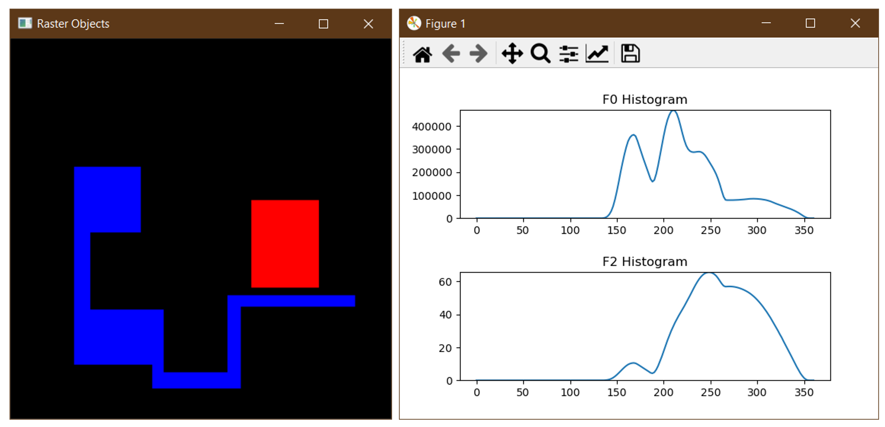

# HoF ROS

This package provides a ROS node to compute Histograms of Forces from a raster image. Example scripts are provided to create test images in the expected format and plot the resulting histograms in real time.



## Installation

Code has been tested on Ubuntu running ROS in WSL.

```
mkdir -p ~/catkin_ws/src
cd ~/catkin_ws/src
git clone git@gitlab.cgi.missouri.edu:buckar/hof_ros.git
cd ~/catkin_ws
catkin_make
source devel/setup.bash
```

## Running

### HoF Node
```
rosrun hof hof_node
```

### Image Publisher
```
python hof_img_pub.py
```

### Histogram Plotter
```
python hof_hist.py
```
